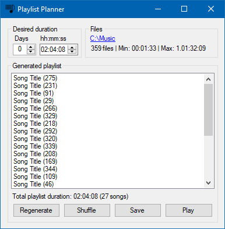

# Playlist Planner

A simple tool to create music playlists of exact durations.

## Screenshot

## Optional Command Line Arguments

1. Path to a folder with music files.
2. Date and time at which the generated playlist should stop playing.
3. Optional offset in seconds.

For example:
`"Playlist Planner.exe" "C:\Users\Yonatan\Music" "02/02/2020 2:02:02 PM" -3` will generate a playlist and start playing it.
